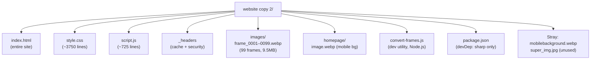
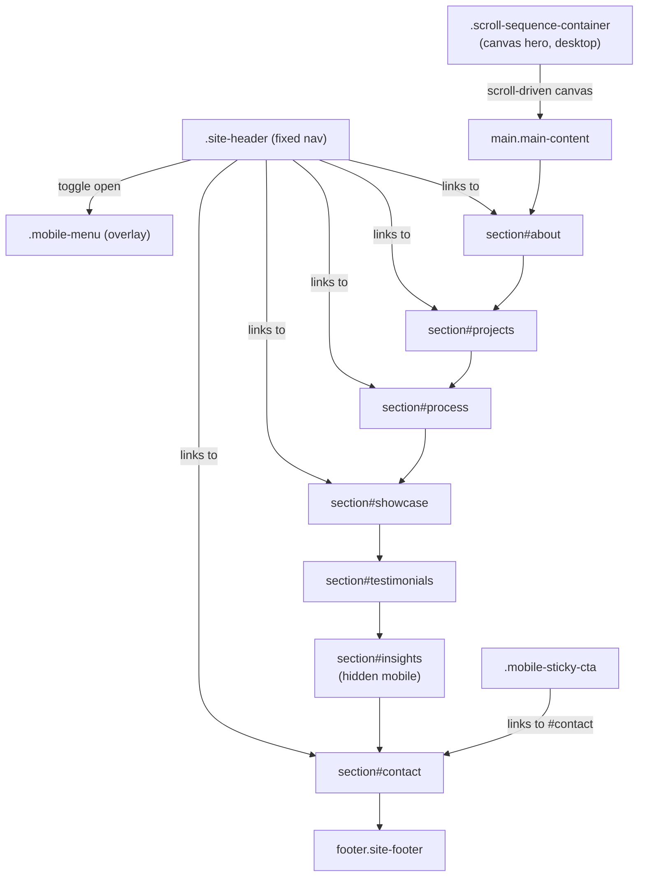
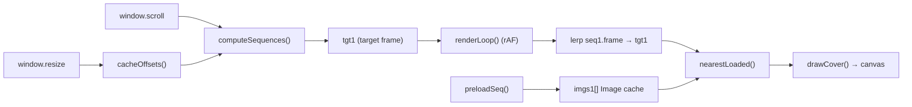
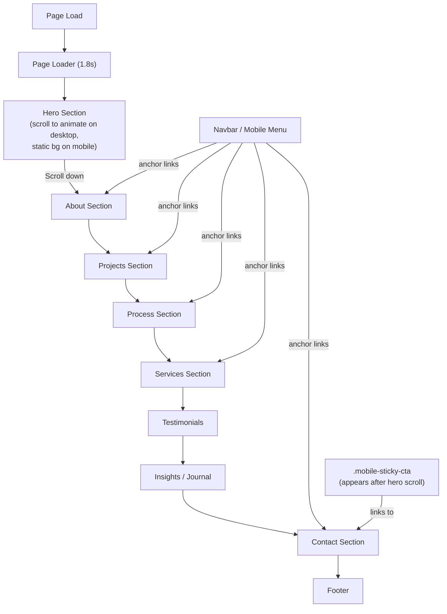

# ARCHITECTURE.md — Future Space Website

> **AI Agent Context Document** — optimized for Claude Code, Codex, Cursor, Devin, and similar agents.  
> Last updated: June 2026. Single-page static website. No build system. No framework.

---

## Table of Contents

1. [Project Overview](#1-project-overview)
2. [Tech Stack](#2-tech-stack)
3. [Folder Structure](#3-folder-structure)
4. [Routing Architecture](#4-routing-architecture)
5. [Component Hierarchy](#5-component-hierarchy)
6. [Data Flow](#6-data-flow)
7. [State Management](#7-state-management)
8. [API Integrations](#8-api-integrations)
9. [Styling System](#9-styling-system)
10. [Assets & Media](#10-assets--media)
11. [Performance Optimizations](#11-performance-optimizations)
12. [SEO Configuration](#12-seo-configuration)
13. [Deployment Architecture](#13-deployment-architecture)
14. [Environment Variables](#14-environment-variables)
15. [Mermaid Diagrams](#15-mermaid-diagrams)
16. [Technical Debt & Known Issues](#16-technical-debt--known-issues)
17. [Future Improvements](#17-future-improvements)
18. [Developer Guide](#18-developer-guide)

---

## 1. Project Overview

**Future Space** is a single-page, zero-framework static website for a premium luxury interior design and architecture studio based in Chennai, India. It is deployed on Vercel at `https://futurespacesweb.vercel.app/`.

The site is a single `index.html` page with one CSS file (`style.css`) and one JavaScript controller (`script.js`). There is no bundler, no framework, no server-side rendering, and no build step.

### Key Design Goals
- **Luxury aesthetic** — dark emerald green palette on desktop, cream on mobile
- **Cinema-quality hero** — scroll-driven canvas frame sequence (99 WebP frames, desktop only)
- **Mobile-first responsiveness** — fully separate mobile layout via CSS media queries
- **Performance** — WebP images, lazy loading, `requestIdleCallback` batch preloading, `Cache-Control: immutable` headers
- **Accessibility** — WCAG-compliant contrast ratios enforced in mobile CSS, semantic HTML5 elements

---

## 2. Tech Stack

| Layer | Technology | Notes |
|---|---|---|
| Markup | HTML5 | Single file: `index.html` |
| Styling | CSS3 (vanilla) | Single file: `style.css`, ~3750 lines |
| Scripting | JavaScript (ES2020, `'use strict'`) | Single file: `script.js`, ~725 lines |
| Animation | GSAP 3.12.5 (loaded via CDN) | Loaded but **not actively used** in current codebase (see Technical Debt) |
| Animation | GSAP ScrollTrigger 3.12.5 (CDN) | Same — loaded but not used |
| Fonts | Google Fonts CDN | Cormorant Garamond (serif), Inter (sans) |
| Images | WebP (converted from JPG/PNG) | `convert-frames.js` utility using `sharp` |
| Dev dependency | `sharp ^0.34.5` | Node.js utility for WebP conversion only |
| Deployment | Vercel | Auto-deploys from `futurespacesweb` GitHub remote |
| Git | Two remotes | `futurespacesweb` (Vercel-linked), `origin` (web3 repo) |
| Cache policy | Custom `_headers` file | 1-year immutable for static assets, no-cache for HTML |

---

## 3. Folder Structure

```
website copy 2/
├── index.html              # Single-page app entry point — entire site markup
├── style.css               # All styles: design tokens, components, media queries
├── script.js               # All JS: cursor, loader, canvas, nav, forms, effects
├── _headers                # Vercel/Netlify HTTP header rules (caching + security)
├── convert-frames.js       # Node.js dev utility: JPG → WebP batch conversion
├── package.json            # devDependencies only (sharp); no build scripts
├── package-lock.json       # Lockfile for sharp
├── .gitignore              # Excludes: images1-5/, node_modules/, .DS_Store, dist/
│
├── images/                 # Hero scroll sequence frames (TRACKED in git)
│   └── frame_0001.webp … frame_0099.webp   # 99 WebP frames ~100KB each
│
├── homepage/               # Mobile hero background
│   ├── image.webp          # Primary mobile hero background (102KB)
│   └── frame_0001.webp     # Duplicate of images/frame_0001.webp (unused, see debt)
│
├── images1/                # Git-ignored alternate frame sets (unused/empty)
├── images3/                # Git-ignored
├── images4/                # Git-ignored
├── images5/                # Git-ignored
│
├── mobilebackground.webp   # 203KB — unused stray asset (see Technical Debt)
├── super_img.jpg           # 2.7MB — unused stray asset (see Technical Debt)
│
└── *.md / *.rtf            # Developer notes (not served, not linked)
    ├── ARCHITECTURE.md     # This file
    ├── changes.md / changes2.md / changes3.md
    ├── color change.md
    ├── mobile fix.md
    ├── mdfile.md
    ├── Future space website wordings.md
    ├── info.md
    └── stb.rtf
```

---

## 4. Routing Architecture

This is a **single-page application with anchor-based navigation only**. There are no routes, no page transitions between URLs, and no JavaScript router.

All navigation targets are `id` attributes on sections within `index.html`:

| Anchor | Section ID | Section Label |
|---|---|---|
| `#` / (root) | `hero-sequence` | Hero scroll sequence |
| `#about` | `about` | 01 — Studio |
| `#projects` | `projects` | 02 — Portfolio |
| `#process` | `process` | 03 — Methodology |
| `#showcase` | `showcase` | 04 — Services |
| `#testimonials` | `testimonials` | 05 — Client Words |
| `#insights` | `insights` | 06 — Journal (hidden on mobile) |
| `#contact` | `contact` | 07 — Begin |

**Navigation elements that link to these anchors:**
- Desktop nav: `.nav-links > .nav-link` elements
- Mobile menu: `.mobile-nav > .mobile-nav-link` elements
- Hero CTAs: `.hero-actions .btn`
- Footer columns: `.footer-col a` links
- Mobile sticky CTA: `#mobile-sticky-cta a`
- Floating mobile CTA: `.mobile-float-cta` (links to `#contact`)

---

## 5. Component Hierarchy

Since this is plain HTML, "components" are CSS class-based UI blocks. The hierarchy below maps the DOM structure:

```
<body>
├── .mobile-float-cta                    # Floating "Book Consultation" link (mobile)
├── #cursor-dot / #cursor-ring / #cursor-glow   # Custom cursor (desktop only)
├── #page-loader                         # Full-screen loading overlay
│   └── .loader-inner > .loader-logo + .loader-bar
│
├── .site-header#site-header             # Fixed pill navbar
│   ├── .brand-logo                      # "FutureSpace" wordmark
│   ├── .nav-links > .nav-link (×5)      # Desktop nav links
│   ├── .nav-actions > .nav-call + .nav-cta-box  # Desktop CTAs
│   └── .nav-menu-btn#nav-menu-btn       # Hamburger toggle
│
├── .mobile-menu#mobile-menu             # Full-screen mobile nav overlay
│   ├── .mobile-nav > .mobile-nav-link (×6)
│   ├── .mobile-menu-actions > .mobile-nav-cta
│   └── .mobile-menu-footer             # Contact links + social links
│
├── .scroll-sequence-container#hero-sequence   # Desktop canvas hero
│   └── .sticky-wrapper
│       ├── canvas#sequence-canvas       # Frame animation target
│       ├── .hero-vignette               # Dark edge overlay
│       ├── #hero-text-1…4              # Phase overlay panels (toggled .active)
│       │   └── .hero-eyebrow + .hero-title + .hero-subtitle + .hero-actions
│       ├── .hero-scroll-cue             # "Scroll" label + animated line
│       ├── .hero-marquee                # Scrolling text strip
│       └── .hero-brand-badge           # Watermark / loading badge
│
└── .main-content (×2 — see Technical Debt)
    ├── section#about.about-section
    │   └── .about-layout
    │       ├── .about-label-col         # Section label + accent image
    │       └── .about-content-col       # Title, body, stats (×4), link
    │           └── .about-stats > .about-stat (×4)
    │
    ├── section#projects.projects-section
    │   └── .projects-grid
    │       └── .project-card (×6)       # 1 large, 1 wide, 4 standard
    │           ├── .project-image-wrapper > img.project-img.lqip + .project-overlay
    │           └── .project-meta
    │
    ├── section#process.process-section
    │   └── .process-layout
    │       ├── .process-header-col
    │       └── .timeline-container > .timeline-step (×6)
    │           └── .step-number + .step-content
    │
    ├── section#showcase.services-section
    │   └── .services-grid > .service-item (×4)
    │       ├── .service-image > img
    │       └── .service-content
    │
    ├── section#testimonials.testimonials-section
    │   └── .testimonials-track > .testimonial-feature (×3)
    │       ├── .testimonial-quote-mark
    │       ├── blockquote.testimonial-body
    │       └── .testimonial-attribution
    │
    ├── section#insights.insights-section   # Hidden on mobile
    │   └── .insights-grid
    │       └── article.insight-card (×3, 1 featured)
    │           ├── .insight-image > img
    │           └── .insight-content
    │
    ├── section#contact.contact-section
    │   └── .contact-layout
    │       ├── .contact-info            # Left column: label, title, body, details
    │       │   ├── .contact-trust       # Service tags (hidden on mobile)
    │       │   ├── .contact-checklist > .contact-check-item (×3)
    │       │   └── .contact-details > .contact-detail-item (×3)
    │       └── .contact-form-wrapper
    │           └── form#contact-form.contact-form
    │               ├── .form-row (×2) > .form-group (×2 each)
    │               ├── .form-group (×3 standalone)
    │               ├── button.btn.btn-form-submit
    │               └── .form-success#form-success
    │
    └── footer.site-footer
        ├── .footer-top-bar
        ├── .footer-body > .footer-cols > .footer-col (×4)
        │   └── .footer-col--newsletter > .newsletter-form
        └── .footer-bottom
            └── .footer-bottom-inner
```

After the closing `</main>`:
```
    └── .mobile-sticky-cta#mobile-sticky-cta   # "Book Free Consultation" bar
```

---

## 6. Data Flow

This is a **purely client-side, static site**. There is no backend, no database, and no API calls for content. All data is hardcoded in `index.html`.

### Contact Form
- **Submission:** `form#contact-form` is handled entirely by `initForm()` in `script.js`
- **Validation:** Client-side only — email regex + required field checks
- **On success:** Shows `#form-success` after 800ms timeout, resets form
- **Backend:** None — **form submissions are currently lost** (no endpoint configured)

### Newsletter Form
- **Submission:** Inline `onsubmit="handleNewsletter(event)"` attribute in HTML
- **On success:** Replaces submit button with checkmark SVG, clears input
- **Backend:** None — same issue as contact form

### Canvas Frame Sequence
```
scroll position → computeSequences() → tgt1 (frame index)
                                     ↓
renderLoop() → lerp seq1.frame → nearestLoaded() → drawCover() → canvas
                                                  ↑
preloadSeq() → batch load Image objects → imgs1[] array
```

### Scroll Reveal
```
IntersectionObserver → .reveal-item / .reveal-title / .reveal-header → add .in-view class
CSS transitions on .in-view → opacity + translateY animation
```

### Active Nav Highlighting
```
IntersectionObserver (rootMargin: -35% top, -45% bottom)
→ section enters viewport center band
→ match section id → find nav-link with matching href
→ toggle .active class on nav-link and mobile-nav-link
```

---

## 7. State Management

No framework state management. All UI state is managed via:

| State | Mechanism | Location |
|---|---|---|
| Canvas frame index | Module-level variables `seq1.frame`, `tgt1`, `drawn1` | `script.js` top-level |
| Image cache | `imgs1[]` array of `Image` objects | `script.js` top-level |
| Scroll offsets | `c1Top`, `c1Height` module vars | `script.js`, set by `cacheOffsets()` |
| Mobile menu open/closed | CSS `.open` class on `#mobile-menu` | Toggled by `menuBtn` click handler |
| Navbar scrolled state | CSS `.scrolled` class on `.site-header` | Set by `updateHeader()` on scroll |
| Hero phase active | CSS `.active` class on `#hero-text-1…4` | Set by `computeSequences()` on scroll |
| Scroll reveal triggered | CSS `.in-view` class on `.reveal-*` | Set by `initReveal()` IntersectionObserver |
| Lazy image loaded | CSS `.loaded` / `.img-loaded` classes | Set by lazy image observer |
| Sticky CTA visible | CSS `.visible` on `#mobile-sticky-cta` | Set by scroll position check |
| Form success state | CSS `.visible` on `#form-success` | Set by `initForm()` submit handler |

---

## 8. API Integrations

| Service | Purpose | Implementation |
|---|---|---|
| Google Fonts | Cormorant Garamond + Inter fonts | `<link>` tag CDN, preconnect hints in `<head>` |
| GSAP CDN | Animation library | `<script>` tag (loaded but **unused**) |
| Unsplash | Project/service/testimonial images | Direct `src` URLs with `?auto=format&fm=webp` params |

**No backend APIs.** No CMS, no analytics, no tracking scripts.

---

## 9. Styling System

### Design Tokens (`style.css` `:root`)

All design values are CSS custom properties (variables). **Always use these tokens — never hardcode raw values.**

| Token Category | Variables |
|---|---|
| Palette (dark) | `--royal-green` `--deep-emerald` `--emerald-mid` `--footer-bg` |
| Palette (gold) | `--accent-gold` `--accent-gold-lt` `--accent-gold-deep` `--champagne` `--champagne-light` |
| Palette (light) | `--background` (#F8F6F1) `--background-alt` `--ivory-deep` `--stone` `--white` |
| Text | `--dark-text` `--dark-text-mid` `--color-text-muted` `--color-text-light` |
| Typography | `--font-serif` (Cormorant Garamond) `--font-sans` (Inter) |
| Motion | `--ease-luxury` `--ease-out` `--ease-in-out` `--ease-spring` |
| Duration | `--dur-fast` (0.35s) `--dur-mid` (0.65s) `--dur-slow` (1.1s) `--dur-cinematic` (1.6s) |
| Shadows | `--shadow-sm` `--shadow-md` `--shadow-lg` `--shadow-gold` |
| Gradients | `--grad-gold` |

### Typography Scale

| Element | Font | Desktop Size | Mobile Size |
|---|---|---|---|
| `.section-title` | Cormorant Garamond | clamp(52px–84px) | clamp(32px–44px) |
| `.contact-title` | Cormorant Garamond | clamp(40px–64px) | clamp(38px–42px) |
| `.hero-title` | Cormorant Garamond | clamp(56px–96px) | clamp(2rem–2.8rem) |
| `.hero-subtitle` | Inter | 1.1rem | 0.92rem |
| `.section-label` | Inter | 10px | 10px |
| `.body-text` | Inter | 16px | 16–17px |
| `.lead-text` | Inter | 1.25rem | 1.1rem |

### Responsive Breakpoints

| Breakpoint | Width | Notes |
|---|---|---|
| Desktop | > 768px | Default styles; canvas hero active |
| Tablet/Mobile | ≤ 768px | Primary mobile breakpoint; static hero image |
| Small mobile | ≤ 480px | Additional overrides for tiny screens |

### Color Contexts

| Context | Background | Foreground | Accents |
|---|---|---|---|
| Desktop hero / footer | `#0B2E20` (deep green) | `#FFFFFF` | `#C8A97E` (gold) |
| All page sections | `#F8F6F1` (cream) | `#1A1A1A` (dark text) | `#B8935A` (deep gold) |
| Mobile contact form | `rgba(255,255,255,0.7)` | `#2A2A2A` | `#B89B6A` |

### CSS Architecture

`style.css` is organized in these sections (in order):

1. `:root` — design tokens
2. Reset & base (`*`, `html`, `body`, `img`, `a`)
3. Custom cursor (`.cursor-dot`, `.cursor-ring`, `.cursor-glow`)
4. Page loader (`.page-loader`)
5. Global layout (`.container`, `.section`, `.section-label`, `.section-title`)
6. Navigation (`.site-header`, `.brand-logo`, `.nav-links`, `.mobile-menu`)
7. Hero scroll sequence (`.scroll-sequence-container`, `.sticky-wrapper`, `.hero-*`)
8. About section
9. Projects section (`.projects-grid`, `.project-card`)
10. Process section (`.timeline-*`)
11. Services section (`.services-grid`, `.service-item`)
12. Testimonials section
13. Insights section
14. Contact section (`.contact-layout`, `.contact-form`)
15. Footer
16. Mobile float CTA
17. Mobile sticky CTA
18. Reveal animations (`.reveal-item`, `.reveal-title`)
19. `@media (max-width: 768px)` — all mobile overrides
20. `@media (max-width: 480px)` — small screen overrides

---

## 10. Assets & Media

### Frame Sequence (Hero Animation — Desktop Only)

- **Location:** `images/frame_0001.webp` … `images/frame_0099.webp`
- **Count:** 99 frames
- **Size:** ~88–105 KB each; ~9.5 MB total
- **Format:** WebP, quality 72, converted via `convert-frames.js`
- **Path template in JS:** `` `images/frame_${String(i).padStart(4, '0')}.webp` ``
- **Usage:** Loaded into `imgs1[]` array, drawn to `canvas#sequence-canvas`

### Mobile Hero Background

- **Location:** `homepage/image.webp`
- **Size:** 102 KB
- **Usage:** CSS `background-image` on `.sticky-wrapper` at `@media (max-width: 768px)`
- **Preloaded:** `<link rel="preload" media="(max-width: 768px)">`

### Section Images (Unsplash CDN)

All project cards, service items, testimonial avatars, and the about accent image are loaded directly from Unsplash CDN URLs with `?auto=format&fm=webp&fit=crop` parameters.
- All have `loading="lazy"` and `decoding="async"`
- Project cards use `srcset` with 400w/700w/900w/1200w variants
- LQIP (Low Quality Image Placeholder) is applied via inline `style` with a `w=20` blurred thumbnail

### Unused / Stray Assets

| File | Size | Issue |
|---|---|---|
| `mobilebackground.webp` | 203 KB | Not referenced anywhere — safe to delete |
| `super_img.jpg` | 2.7 MB | Not referenced — safe to delete |
| `homepage/frame_0001.webp` | 102 KB | Duplicate of `images/frame_0001.webp` — safe to delete |

---

## 11. Performance Optimizations

| Optimization | Implementation |
|---|---|
| WebP images | All local frames converted; Unsplash CDN serves WebP via `?fm=webp` |
| Lazy loading | All `` except hero use `loading="lazy" decoding="async"` |
| LQIP blur-up | Project images use inline `style` with `w=20` placeholder URL |
| Canvas frame batch loading | `requestIdleCallback`-based batches of 30 frames to avoid blocking main thread |
| Desktop-only canvas | `isMobile()` check prevents canvas init, preloading, and scroll logic on mobile |
| Resource hints | `<link rel="preconnect">` for Google Fonts; `<link rel="preload">` for first 3 hero frames (desktop) and mobile bg (mobile) |
| Immutable cache headers | `_headers` sets `Cache-Control: public, max-age=31536000, immutable` for all JS, CSS, and image assets |
| Native scroll | Lenis is intentionally not used — comment in `script.js` confirms this |
| `will-change` | Applied to cursor elements to promote GPU compositing |
| IntersectionObserver | Used for reveal animations, nav highlighting, stats counter, and lazy images — no scroll event polling |
| Throttled resize | Canvas resize uses `setTimeout(..., 100)` debounce |
| Mobile lazy image margin | 1800px bottom rootMargin on mobile so images below the tall hero load eagerly |
| Security headers | `X-Content-Type-Options`, `X-Frame-Options: DENY`, `X-XSS-Protection` in `_headers` |

---

## 12. SEO Configuration

| Tag | Value |
|---|---|
| `<title>` | Future Space — Architecture & Interior Design Studio |
| `<meta name="description">` | Premier architecture and interior design studio in India |
| `<meta name="viewport">` | `width=device-width, initial-scale=1.0, maximum-scale=5.0, viewport-fit=cover` |
| `<meta name="theme-color">` | `#0F3D2E` |
| Canonical | Not set |
| Open Graph | Not set |
| Structured data | Not set |
| `lang` attribute | `en` on `<html>` |
| Image `alt` text | Set on all images |
| Semantic HTML | `<header>`, `<main>`, `<section>`, `<footer>`, `<article>`, `<nav>`, `<blockquote>` used correctly |

---

## 13. Deployment Architecture

```
Developer machine
      │
      ├── git push futurespacesweb main  ──→  GitHub: freelancing20261377-sudo/futurespacesweb
      │                                              │
      │                                              └──→  Vercel (auto-deploy)
      │                                                     └──→  https://futurespacesweb.vercel.app/
      │
      └── git push origin main  ──→  GitHub: freelancing20261377-sudo/web3  (backup)
```

- **Vercel** serves the site as a static deployment from the `futurespacesweb` remote
- No build command — Vercel deploys the files as-is
- `_headers` file controls HTTP response headers (Vercel/Netlify both respect this format)
- HTML has `Cache-Control: max-age=0, must-revalidate` so new deployments are immediately live

---

## 14. Environment Variables

**None.** This is a static site with no server-side code, no `.env` files, and no runtime configuration.

---

## 15. Mermaid Diagrams

### Folder Structure


### Component / Section Relationships


### Canvas Data Flow


### User Navigation Flow


---

## 16. Technical Debt & Known Issues

### Critical

| # | Issue | Location | Impact |
|---|---|---|---|
| 1 | **Two `<main>` tags** | `index.html` lines 168 and 410 | Invalid HTML; the first `</main>` closes at line 408, then a second `<main>` opens at 410. Breaks DOM semantics and screen readers. |
| 2 | **Contact form has no backend** | `index.html` form, `script.js initForm()` | Form submissions show a success UI but data is never sent anywhere. Users think they submitted but nothing is received. |
| 3 | **Newsletter form has no backend** | `index.html` footer form | Same — `handleNewsletter()` is pure client-side UI only. |
| 4 | **Placeholder phone/email in footer** | `index.html` lines 777–778 | Footer shows `tel:1234567890` and `info@mysite.com` placeholder values, not the real contact info. |

### Moderate

| # | Issue | Location | Impact |
|---|---|---|---|
| 5 | **GSAP loaded but unused** | `index.html` `<head>` | Two CDN scripts (~100KB combined) add network/parse overhead with zero benefit. |
| 6 | **`homepage/frame_0001.webp` duplicate** | `homepage/` folder | Identical to `images/frame_0001.webp`. Wastes 102KB. |
| 7 | **`mobilebackground.webp` unused** | root folder | 203KB file with no reference in HTML, CSS, or JS. |
| 8 | **`super_img.jpg` unused** | root folder | 2.7MB JPEG with no reference anywhere. Largest file in repo. |
| 9 | **Canvas resize handler wraps mobile check inconsistently** | `script.js` line 417 | The first resize handler (lines 417–425) does not check `isMobile()` before calling `scaleAllCanvases()`. The `isMobile()` function is defined later at line 476. Could cause initialization order issues if refactored. |
| 10 | **`images1/`, `images3/`, `images4/`, `images5/` exist but are empty and git-ignored** | root folder | Dead directories. The `_headers` file still configures cache rules for them. |
| 11 | **`-webkit-line-clamp` without standard `line-clamp`** | `style.css` ~5 locations | CSS lint warnings. Not critical but should add `line-clamp` alongside `-webkit-line-clamp`. |

### Minor

| # | Issue | Location | Impact |
|---|---|---|---|
| 12 | **Multiple developer `.md` files in root** | Root dir | `changes.md`, `changes2.md`, `changes3.md`, `color change.md`, `mobile fix.md`, `mdfile.md` — not served, but clutter the repo. |
| 13 | **Unsplash images for project portfolio** | `index.html` | Stock photos from Unsplash, not actual project photos. Fine for demo, must be replaced for production. |
| 14 | **`Open Graph` / `Twitter Card` meta tags missing** | `index.html <head>` | Social sharing previews will show no image or description. |
| 15 | **No canonical URL** | `index.html <head>` | Minor SEO issue. |

---

## 17. Future Improvements

### Priority 1 — Functional Gaps (blocking production use)

1. **Wire up the contact form** — integrate a form backend such as Formspree, Netlify Forms, EmailJS, or a custom serverless function. Replace the `setTimeout` mock with a real `fetch()` POST.
2. **Wire up newsletter form** — same options as above.
3. **Replace placeholder contact data** — update phone number and email in the footer.
4. **Fix double `<main>` tag** — merge the two `<main>` elements into one wrapping the entire page content.

### Priority 2 — Performance / Asset Cleanup

5. **Remove GSAP CDN scripts** — if GSAP is not being used, remove both `<script>` tags from `<head>` to save ~100KB of load time.
6. **Delete unused stray assets** — remove `mobilebackground.webp`, `super_img.jpg`, `homepage/frame_0001.webp`.
7. **Remove empty image directories** — delete `images1/`, `images3/`, `images4/`, `images5/`.
8. **Replace Unsplash images with actual project photos** — store locally as WebP for production.

### Priority 3 — SEO & Discoverability

9. **Add Open Graph tags** — `og:title`, `og:description`, `og:image`, `og:url`.
10. **Add `<link rel="canonical">`**.
11. **Add JSON-LD structured data** — `LocalBusiness` or `ProfessionalService` schema for the studio.
12. **Add `robots.txt` and `sitemap.xml`**.

### Priority 4 — Developer Experience

13. **Split `style.css` into modules** — the single 3750-line CSS file is hard to maintain. Consider splitting into `tokens.css`, `layout.css`, `components.css`, `mobile.css`.
14. **Add `-webkit-line-clamp` companion `line-clamp`** to fix lint warnings.
15. **Remove developer `.md` files** from the repo root or move to a `_docs/` folder.

---

## 18. Developer Guide

### How to Safely Modify Layouts

The layout system uses CSS Grid (`.contact-layout`, `.projects-grid`, `.services-grid`, `.footer-cols`) and Flexbox (`.about-layout`, `.process-layout`, `.nav-links`). 

- **Desktop grid column changes:** Edit the `grid-template-columns` property directly on the parent element in `style.css`.
- **Mobile layout:** Override in the `@media (max-width: 768px)` block. Desktop base styles must not be changed — only add/override inside media queries.
- **Container width:** `.container` has `max-width: 1520px` and `padding: 0 88px`. Do not reduce padding below 20px.

### How to Safely Modify Navigation

- **Desktop nav links:** Add/remove `<a href="#section-id" class="nav-link">` inside `.nav-links` in `index.html`.
- **Mobile nav links:** Mirror the same change in `.mobile-nav` in `index.html`.
- **Active highlighting:** Automatic via `initActiveNavHighlight()` in `script.js` — it reads `href` attributes and matches against section IDs. New nav links targeting valid section IDs will highlight automatically.
- **Navbar appearance:** Styles in `.site-header` block in `style.css`. The pill shape is `border-radius: 100px` — do not remove.
- **Scrolled state:** `.site-header.scrolled` is applied when `scrollY > 60`. Adjust that threshold in `updateHeader()` in `script.js`.

### How to Safely Modify Styling

- **Always use CSS variables** from `:root` — never hardcode colors.
- **Light sections** (about, projects, process, services, testimonials, contact) use `--background` (#F8F6F1) as background with `--dark-text` foreground.
- **Dark sections** (hero, footer) use `--footer-bg` / `--royal-green` as background with `--white` foreground.
- **Gold accents on dark:** Use `--accent-gold` (#C8A97E).
- **Gold accents on light:** Use `--accent-gold-deep` (#B8935A) for sufficient contrast.
- **Mobile-specific overrides:** Always write mobile CSS inside `@media (max-width: 768px)` at the bottom of `style.css`.

### How to Safely Modify Animations

- **Scroll reveal:** Elements with `.reveal-item`, `.reveal-title`, or `.reveal-header` animate in automatically via `initReveal()`. Add the class to any new element to opt into the reveal. The animation (opacity + translateY) is defined in the reveal section of `style.css`.
- **Hero text phases:** The 4 overlay phases are controlled by `HERO_PHASES` array in `script.js` (lines 224–229). Each entry is `[startFraction, endFraction]` of scroll progress. Adjust fractions to change when each phase appears.
- **Canvas lerp speed:** Controlled by the `0.22` multiplier in `renderLoop()` (`seq1.frame += d1 * 0.22`). Increase for snappier, decrease for smoother.
- **Stat counter duration:** `duration = 2000` (ms) in `initCounter()` in `script.js`.
- **CSS transitions:** All durations use `--dur-*` variables. All easings use `--ease-*` variables.

### How to Safely Modify Forms

- **Add a field:** Add a `.form-group` with `<label>` and `<input>` in `index.html`. If `required`, it will be automatically validated by `initForm()`. No JS changes needed for basic fields.
- **Change validation:** Edit `initForm()` in `script.js`. Email validation regex is at line 363.
- **Connect to a backend:** Replace the `setTimeout(() => { success.classList.add('visible') }, 800)` block in `initForm()` with a `fetch()` POST to your endpoint. Show success/error based on response.
- **Form styles:** Edit `.form-group`, `.form-group input`, `.form-group select`, `.form-group textarea` in `style.css`. Mobile overrides in `@media (max-width: 768px)`.

### How to Modify the Hero Canvas Sequence

- **Frame count:** Change `TOTAL_FRAMES_HERO` in `script.js` and ensure the corresponding frames exist in `images/`.
- **Frame path:** Modify `heroFramePath` function in `script.js`.
- **Add/replace frames:** Replace files in `images/` directory with new WebP files following the `frame_XXXX.webp` naming convention. Use `convert-frames.js` to batch-convert from JPG/PNG.
- **⚠ Never modify `.scroll-sequence-container` desktop base styles** (`height: 380vh`, `background: var(--footer-bg)`) — these control the scroll distance and are required for the animation to work on desktop.
- **Mobile background:** Replace `homepage/image.webp` with a new WebP file. CSS reference is `background-image: url('homepage/image.webp')` in `.sticky-wrapper` at `@media (max-width: 768px)`.

### How to Modify the Mobile Hero

- All mobile hero overrides are in `@media (max-width: 768px)` in `style.css`.
- The hero on mobile is **purely CSS** — the canvas is hidden, the `.sticky-wrapper` becomes a full-screen CSS background image.
- JavaScript canvas/scroll logic is **gated** by `if (!isMobile())` — do not move these checks.
- To change the mobile background: swap `homepage/image.webp`.
- To adjust text: modify `.hero-eyebrow`, `.hero-title`, `.hero-subtitle` in the 768px media query.

### How to Deploy

```bash
# Make changes to index.html, style.css, or script.js
git add .
git commit -m "your message"
git push futurespacesweb main   # triggers Vercel auto-deploy
# optionally also push to origin:
git push origin main
```

Vercel will auto-deploy within ~30 seconds. New HTML is immediately live (no-cache headers). CSS/JS changes may be cached for up to 1 year in browsers that already loaded the old version.
